# Aplicacion La Luna Alcobendas 
Esta obra está bajo una <a rel="license" href="http://creativecommons.org/licenses/by-nc/4.0/">
          licencia de Creative Commons Reconocimiento-NoComercial 4.0 Internacional</a>.
<a rel="license" href="http://creativecommons.org/licenses/by-nc/4.0/">
  
</a> 

La Luna Alcobendas es una asociación de ocio y tiempo libre para personas con discapacidad. Cada fin de semana hay una actividad en la que bien podemos ir a tomar algo o a un partido de rugby.

Esta aplicación surge de la necesidad de mantener a nuestros chavales siempre informados de las próximas actividades y a su vez a los monitores una plataforma donde poder gestionar dichas actividades, tener información sobre los usarios, 
y poder gestionar las evaluaciones que hacemos de cada actividad. 

A continuación se muestra el prototipado de la aplicación,cómo instalar y arrancar. 

Aplicación realizada con Vue.js, Vuetify como material design y Laravel de lado servidor. 

Backend: https://github.com/SaraSat/Api_LaLuna 

## Project setup
```
npm install vue cli (local)
vue add vuetify
```

### Compiles and hot-reloads for development
```
npm run serve
```

### Compiles and minifies for production
```
npm run build
```

### Customize configuration
See [Configuration Reference](https://cli.vuejs.org/config/).
# Aplicacion-Vue-LaLuna


# Prototipado: 

## Página de inicio: 

En las siguientes imágenes se puede ver cómo es la página de inicio. Sencillamente se informa de la actividad más próxima, 
incluyendo un mapa para así ver mejor el lugar de quedada y recogida de la actividad.
Esta información la podrán modificar los monitores logueados como se podrá ver más adelante.
Imagenes: 


<br>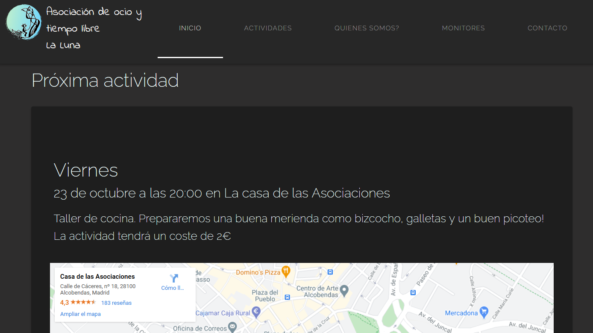<br>

<br>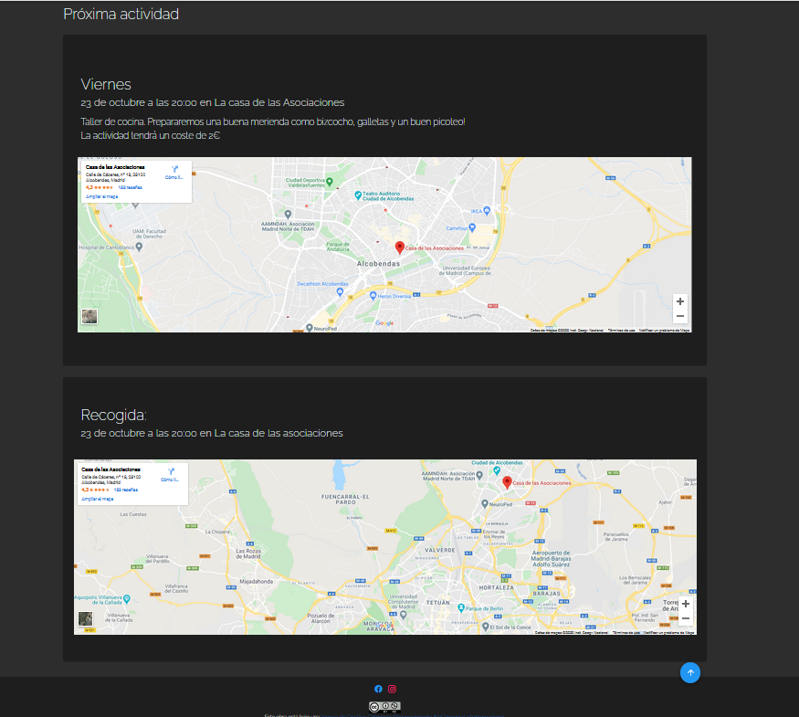<br>

## Página Actividades: 
Donde se podrán visualizar las actividades previstas para ese trimestre. Al igual que en la página de inicio, ésta, la podrán gestionar tanbién los monitores con loguin.

<br>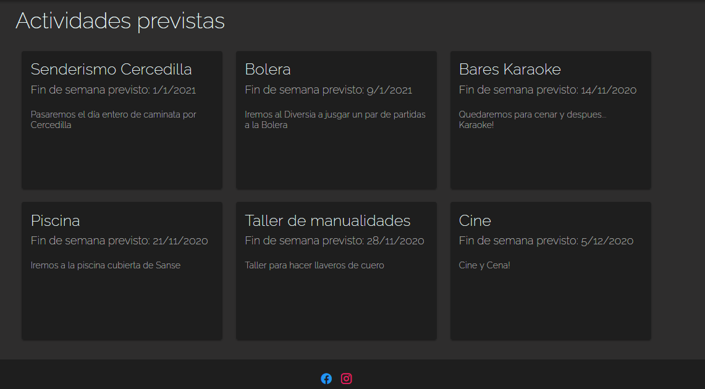<br>


## Quiénes somos?:

En esta página podemos encontrar una galería de imágenes de las actividades que vamos realizando y una pequeá descripción de lo que somos y lo que hacemos. 
Imagenes: 


<br>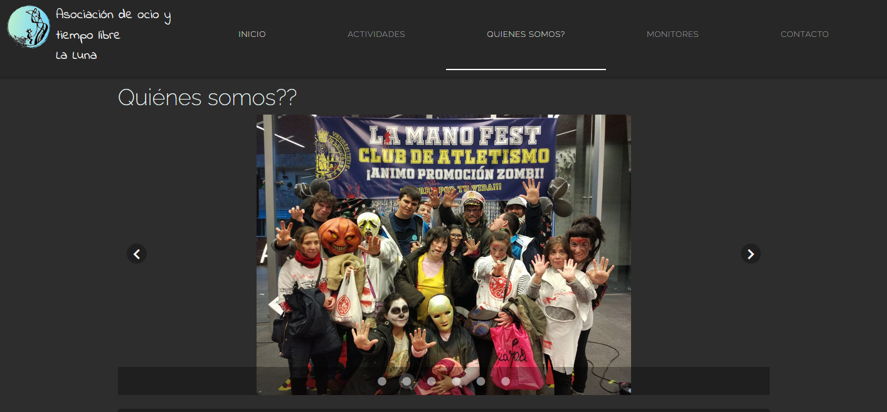<br>

<br><br>

## Contacto: 
Página dónde encontraremos los enlaces a nuestros correos electrónicos, facebook, instagram y teléfono. Ademas de un mapa de nuestra ubicación.

## Monitores: 

Los monitores registrados tienen diversas funcionalidades. Una vez logados podrán modificar la página de inicio y actividades, crear una aviso, gestionar la lista de información de los chavales de la Luna y creación y gestión de las evaluaciones de las actividades que vamos realizando. 
Además, todos los formularios creados para la gestión de datos tienen validación del lado servidor, por lo que se nos avisará cuando falten datos o estos estén mal introducidos. 

Los monitores que sea administradores podrán Registrar a otros monitores


A continuación se muestran los ejemplos: 

## Acceso a Monitores: 
Una vez logados los monitores podrán acceder a la tabla de teléfonos de los luneros, a gestionar las evaluaciones y, aquellos administradores, podrán registrar a otros monitores: 

Imagenes: 


<br>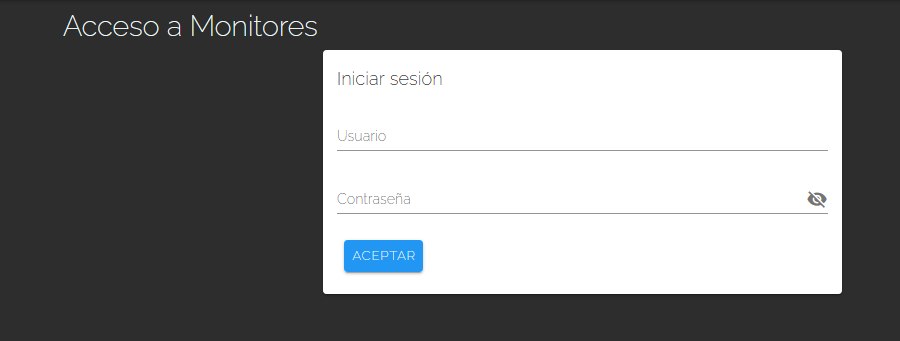<br>

<br>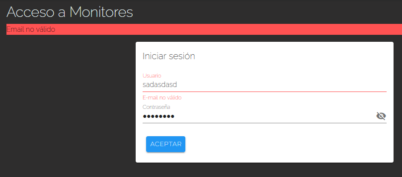<br>

Una vez logado:

Imagenes: 

<br>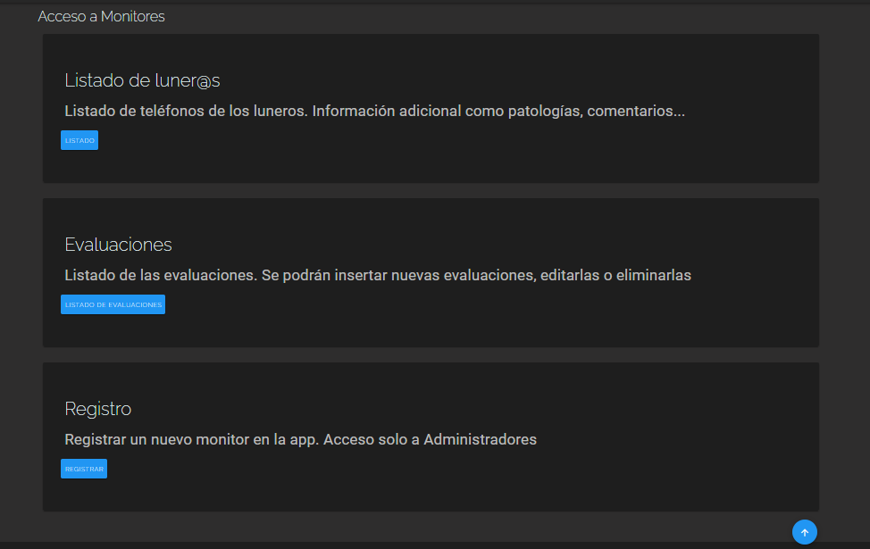<br>


### Tabla Luneros: 
Imagenes: 


<br>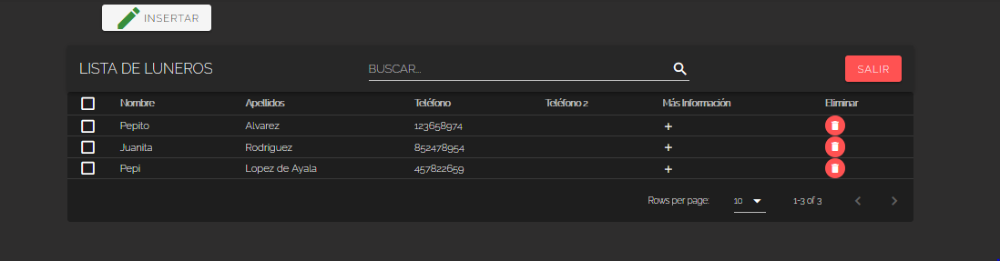<br>

<br>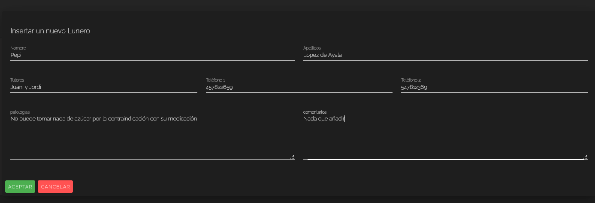<br>

El listado consiste en una dataTable en la que podemos buscar por nombre, apellidos... se puede ordenar por orden alfabético, y elegir el número de filas que ver por página de la tabla. 
Además se pueden añadir nuevos chavales o eliminarlos. 

## Evaluaciones: 
Se podrán añadir, eliminar o editar las existentes. Consiste en un formulario sencillo a rellenar: 

Imagenes: 

<br>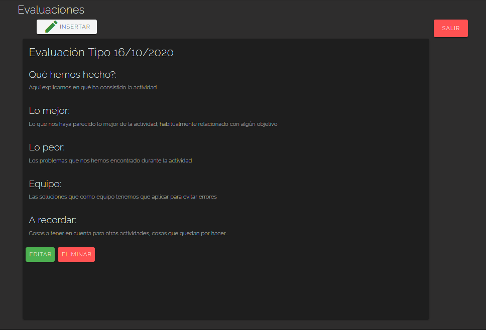<br>


## Registro: 
Únicamente para aquellos con contraseña de Administradores: 
Imagenes: 

<br>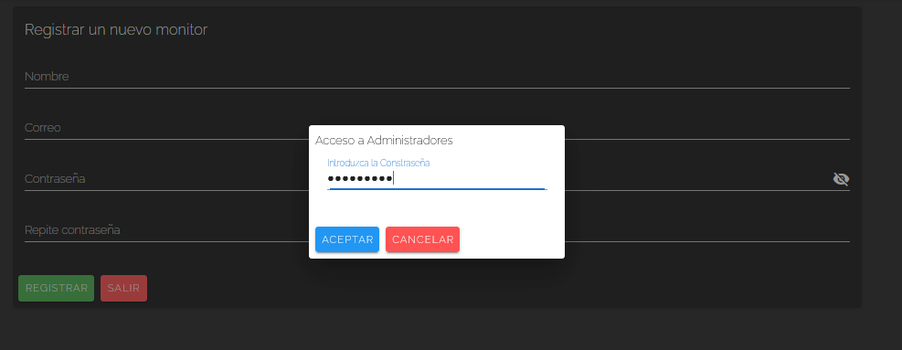<br>


## Página de Inicio y página Actividades: 
Además de estas funcionalidades, la página de inicio y la de actividades, cambia para que los monitores la puedan modificar. 
De tal modo en la página de inicio se pueden crear avisos o modificar la actividad principal y, en la página de actividades se podrá gestionarlas, pudiendo
editar, eliminar y añadir nuevas actividades: 

Imagenes: 


<br>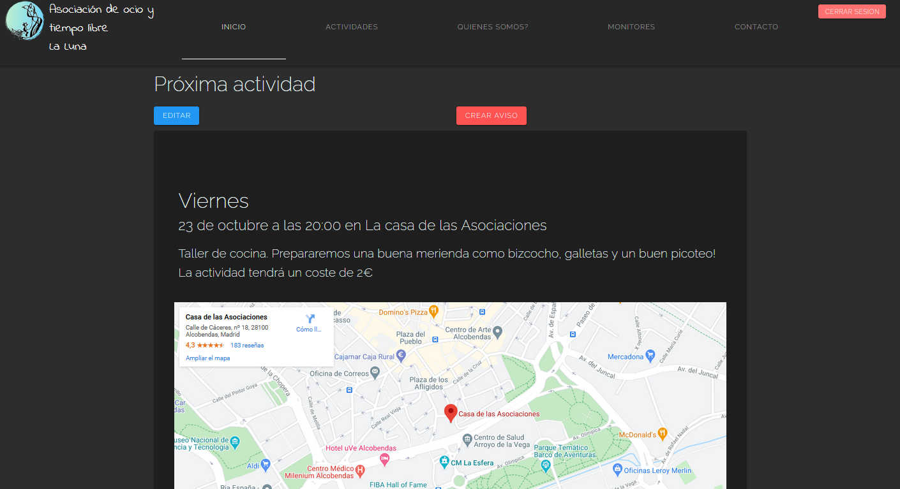<br>

<br>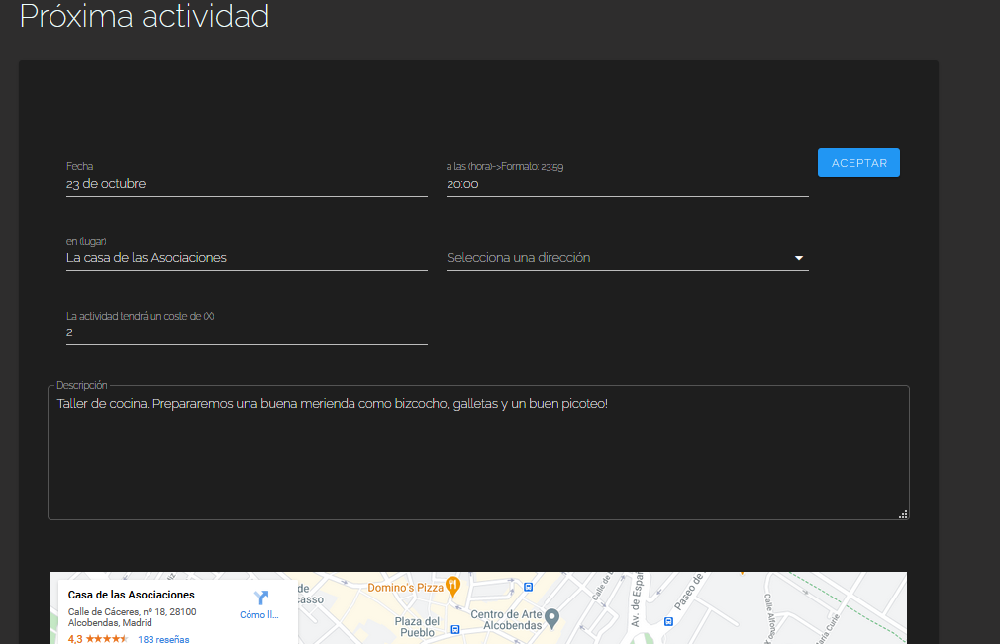<br>

<br>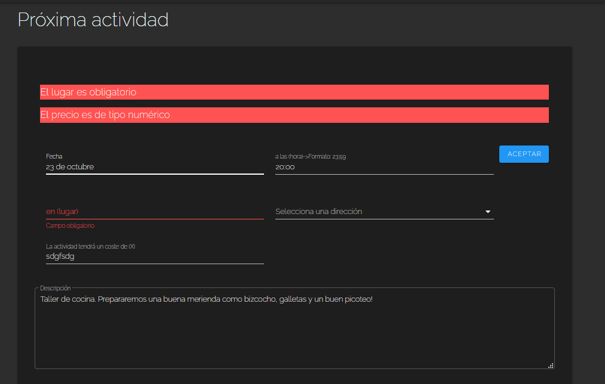<br>

<br>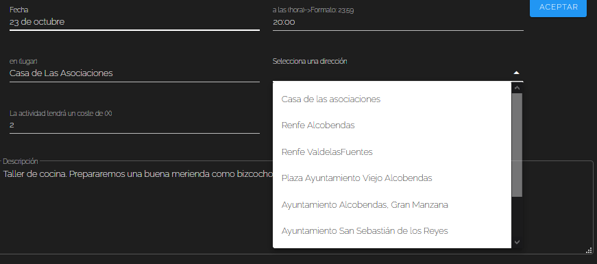<br>

<br>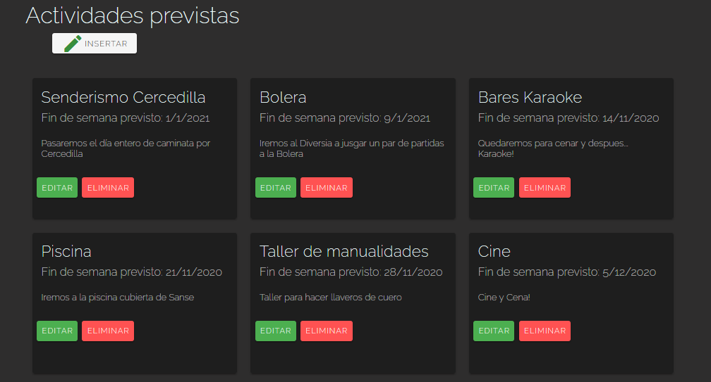<br>


